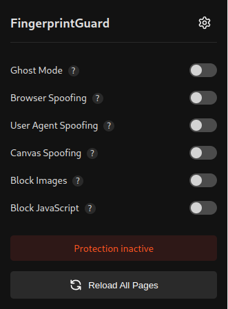
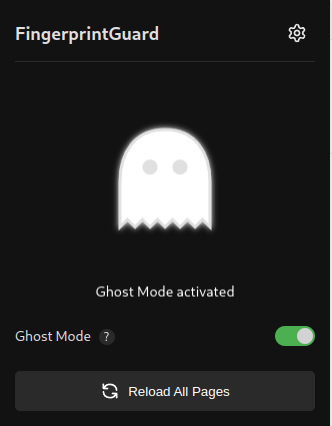

# Fingerprint Guard

Cette extension vous protège contre le fingerprinting.

## Tester 🧪

Vérifie l'efficacité de Fingerprint Guard sur ces sites :

1. **What Is My Browser** : [whatismybrowser.com](https://www.whatismybrowser.com)
2. **BrowserLeaks** : [browserleaks.com](https://browserleaks.com)
3. **Cover Your Tracks** : [coveryourtracks.eff.org](https://coveryourtracks.eff.org)

Noter que **Ghost Mode** peut casser certains sites si vous l'activer.

## Screenshots 📸

 

